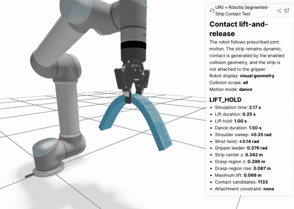
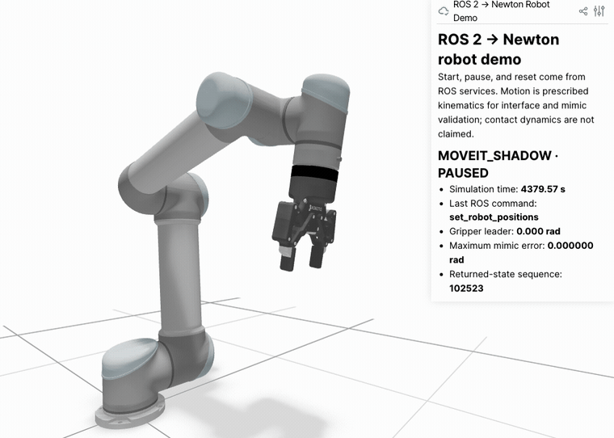

# UR5 + Robotiq 2F-85 MoveIt Demo

ROS 2 Humble learning project that combines a UR5 arm and a Robotiq 2F-85 gripper into one robot description, one `ros2_control` bringup, and one sequential MoveIt task.

The ROS 2 robot demo uses fake hardware and RViz. It does not simulate gravity, contact, friction, or grasped-object physics. A separate Newton physics learning experiment is documented below.

## Presentation quick path

The project asks one engineering question: **how can a planned UR5 motion be evaluated against physical effects that fake hardware does not represent?**

```text
MoveIt 2 plans the desired UR5 trajectory
                  ↓
ROS 2 controllers execute and expose the reference state
                  ↓
ROS–Newton bridge validates, synchronizes, and translates state
                  ↓
Newton represents robot motion, gravity, contact, friction, and deformable objects
                  ↓
Measured state and errors return to ROS 2
```

### This week's verified progression

| Milestone | Evidence | Engineering conclusion |
|---|---|---|
| ROS–Newton process bridge | start, pause, reset, returned pose/time, and stale-data detection | Commands and measured state cross the Python 3.10/3.12 boundary observably. |
| UR5 + Robotiq import | 24 bodies, 24 Newton joints, 54 shapes, zero mimic-mapping error | The combined mechanism loads and its one-leader/five-follower gripper mapping is explicit. |
| Deformable-strip study | FEM convergence plus a faster compliant-joint approximation | Model resolution changes both runtime and predicted deflection; the segmented model is the integration candidate. |
| Contact grasp | center grasp lifts and releases; zero-friction control falls | Contact and friction, rather than a hidden attachment, support the strip. |
| 180-degree stress motion | grasp-height change `0.88 mm`; drop only after opening | Newton preserves the dynamic object response during a large prescribed robot motion. |
| MoveIt shadow execution | full task succeeds; start guard passes after synchronization; final max error `3.4e-8 rad` | MoveIt reference motion now reaches the Newton robot through the bridge, while the existing fake controller remains authoritative. |

### Report media

- [Sphere-drop physics replay](docs/experiments/newton-radius/results/lesson01_replay.gif)
- [FEM rubber-strip oscillation](docs/experiments/newton-soft-strip/results/soft_strip_oscillation.gif)
- [Compliant-joint segmented-strip oscillation](docs/experiments/newton-soft-strip/results/segmented_strip_oscillation.gif)
- [Center-grasp success](docs/experiments/newton-robot-grasp/results/center_grasp_success.gif)
- [180-degree grasp stress test](docs/experiments/newton-robot-grasp/results/newton_180deg_dance_grasp.gif) ([20-second MOV](docs/experiments/newton-robot-grasp/results/newton_180deg_dance_grasp.mov))
- [MoveIt-to-Newton shadow execution](docs/experiments/newton-ros2-bridge/results/moveit_newton_shadow_execution.gif) ([MOV](docs/experiments/newton-ros2-bridge/results/moveit_newton_shadow_execution.mov))
- [ROS 2-commanded Newton robot screenshot](docs/images/newton_ros2_kinematic_demo.png)

For a concise spoken walkthrough, use the [Traditional Chinese presentation guide](docs/REPORT_GUIDE_2026-09-18.zh-TW.md). Detailed English evidence remains in the linked experiment records below.

## Verified milestone

On 2026-09-03, the complete task was verified in RViz with all four controllers active. The approach, lift/transport, and automatic-return Cartesian paths each reached 100%, and the process finished cleanly.

```text
UR5 motion planning + Robotiq action control + automatic Cartesian return
                         -> PICK AND PLACE DEMO SUCCEEDED
```

## Newton physics learning experiment (separate from ROS)


CPU sphere-drop experiment with a 0.20 m radius and 1.00 m initial center height. This is a 2D replay of measured Newton positions, not a live simulator recording. Left: normal gravity with ground; middle: half gravity with ground; right: no collision ground. This experiment is **not yet integrated with ROS 2 or the UR5/Robotiq demo**.

[Read the experiment, learner observations, source code, and data](docs/experiments/newton-radius/README.md).

## Newton FEM soft-strip experiment

On 2026-09-11, a `0.40 × 0.05 × 0.02 m` cantilevered rubber-like strip was modeled with Newton's tetrahedral FEM and VBD solver. The experiment verifies mesh topology, fixed-boundary preservation, finite particle state, a quantitative near-settled condition, and longitudinal mesh sensitivity.


The approximately 2× playback shows the 20-cell model deforming and oscillating under gravity while its left face remains fixed. The animation is qualitative evidence; the measurements below provide the numerical acceptance evidence.

The equilibrium free-tip deflection changed by `5.60%` from 20 to 40 longitudinal cells, then by `1.27%` from 40 to 80 cells. The result therefore passes the predefined 5% **X-direction** convergence threshold between the two finest meshes. Material calibration, transient convergence, full 3D mesh convergence, and robot contact remain future work.

A second model represented the strip as 20, 40, and 80 rigid segments joined by compliant revolute joints. Its 40-to-80 equilibrium-deflection change was `4.91%`, and the 80-segment result was within `1.67%` of the validated FEM result while running about `8.1×` faster. The convergence and settling checks passed narrowly, so the segmented chain is the fast integration candidate while FEM remains the higher-detail reference.


The 20-segment recording makes the representation explicit: each colored link remains rigid while compliant revolute joints create the strip-scale bending and oscillation.

[Read the detailed soft-strip experiment and reproduce the prototype](docs/NEWTON_SOFT_STRIP_EXPERIMENT.md) ([繁體中文學習筆記](docs/NEWTON_SOFT_STRIP_EXPERIMENT.zh-TW.md)).

## Newton robot-contact grasp milestone

On 2026-09-15, the imported UR5/Robotiq used Newton contact to lift a pre-positioned 20-segment strip from its center region and release it by opening the gripper. The robot followed prescribed joint coordinates; the strip remained dynamic and had no attachment constraint.



The validated friction-dependent case used `0.376 rad` closure, `1.5` friction, and a `0.25 s` lift with an estimated `11.52 m/s²` peak acceleration. Its grasp region followed the commanded `0.120 m` lift by `0.119569 m`, an absolute error of `0.431 mm`, while a matched zero-friction control fell during contact hold. A subsequent prescribed-motion stress test combined shoulder motion with an approximately 180-degree wrist offset; the grasp-region height changed by only `0.88 mm` across the motion and the strip dropped `0.386272 m` after opening. The robot remains kinematic, so this validates simulated object/contact response rather than physical motor torque capability.

[Read the robot contact-grasp experiment, failed hypotheses, corrected metric, and reproduction steps](docs/NEWTON_ROBOT_GRASP_EXPERIMENT.md) ([繁體中文學習筆記](docs/NEWTON_ROBOT_GRASP_EXPERIMENT.zh-TW.md)).

## Newton–ROS 2 bridge milestone

On 2026-09-10, a minimal bidirectional bridge was verified while keeping ROS 2 Humble on Python 3.10 and Newton 1.5.1 on its validated Python 3.12 environment. ROS services started, paused, and reset a Newton sphere simulation; Newton's measured pose and simulation time returned through ROS topics. Stopping Newton caused the bridge to report stale data instead of treating the last pose as current.

On 2026-09-11, the combined UR5/Robotiq model was imported into Newton with 24 bodies, 24 Newton joints, and 54 shapes. A ROS service then controlled an eight-second kinematic sequence, while Newton returned all 12 revolute-joint states and a verified maximum mimic-mapping error of `0.0 rad`.


The captured final state shows the complete imported robot, `COMPLETE · PAUSED` at 8.00 s, the last ROS start command, zero reopened-gripper angle, zero mimic-mapping error, and an increasing returned-state sequence. It is evidence of the current kinematic integration milestone, not of MoveIt trajectory execution or physical grasping.

This verifies the command-and-feedback architecture, robot URDF import, forward kinematics, and explicit Robotiq mimic mapping. The demonstration uses prescribed kinematics; Newton has not replaced fake hardware or validated dynamic contact and grasping.

On 2026-09-17, MoveIt's active `FollowJointTrajectory` path and six-joint order were audited. A start-state guard correctly rejected the original Newton demonstration pose because its elbow and wrist-2 each differed from ROS by `1.5708 rad`. An explicit paused-state synchronization reduced the maximum difference to `5.25e-8 rad`, after which a shadow-execution mode forwarded the live controller reference into Newton. The complete existing MoveIt task again reached 100% for approach, lift/transport, and return and ended with `PICK AND PLACE DEMO SUCCEEDED`; Newton reported `MOVEIT_SHADOW` with a final maximum arm error of `3.40e-8 rad`.



A separate presentation-motion trial made the Cartesian displacement visually clear: approach `(0.03, 0.10, -0.05) m`, transport `(-0.03, -0.30, 0.10) m`, and automatically computed return `(0.00, 0.20, -0.05) m`. All three paths reached 100%, the final Cartesian target matched the work-start pose, and the final shadow error was `5.86e-8 rad`. The enlarged values are a verified fake-hardware/shadow demonstration, not validated real-robot limits.

This is a verified planning-to-simulator data path and visual execution milestone. The fake controller still owns `/joint_states`; Newton is not yet the dynamic trajectory controller, and the contact-grasp scene has not yet been combined with the MoveIt task.

[Read the technical integration record](docs/NEWTON_ROS2_INTEGRATION.md), its [繁體中文學習筆記](docs/NEWTON_ROS2_INTEGRATION.zh-TW.md), the [中文主題索引](docs/NEWTON_ROS2_LEARNING_LOG.zh-TW.md), or the [報告操作單](docs/REPORT_GUIDE_2026-09-18.zh-TW.md).

## Portfolio map

- [Learning journey](docs/LEARNING_JOURNEY.md) ([繁體中文](docs/LEARNING_JOURNEY.zh-TW.md)) — how the project progressed from a UTM environment to a verified integrated demo
- [Operations guide](docs/OPERATIONS_GUIDE.md) — repeatable startup, execution, and parameter-editing instructions
- [Troubleshooting record](docs/TROUBLESHOOTING.md) — failures, diagnostic evidence, fixes, and engineering lessons
- [Newton–ROS 2 integration](docs/NEWTON_ROS2_INTEGRATION.md) ([繁體中文](docs/NEWTON_ROS2_INTEGRATION.zh-TW.md)) — verified bridge, evidence, limitations, and robot-model compatibility decisions
- [Newton soft-strip modeling experiments](docs/NEWTON_SOFT_STRIP_EXPERIMENT.md) ([繁體中文](docs/NEWTON_SOFT_STRIP_EXPERIMENT.zh-TW.md)) — FEM and compliant-joint representations, convergence evidence, runtime tradeoff, and reproducible source
- [Newton robot contact-grasp experiment](docs/NEWTON_ROBOT_GRASP_EXPERIMENT.md) ([繁體中文](docs/NEWTON_ROBOT_GRASP_EXPERIMENT.zh-TW.md)) — failed hypotheses, contact geometry, center grasp, corrected metrics, and release evidence
- [中文學習索引](docs/NEWTON_ROS2_LEARNING_LOG.zh-TW.md) — topic map, milestone sequence, and recommended reading order

## Current demo

The C++ node executes this sequence:

```text
open gripper
→ move to test_configuration
→ Cartesian approach
→ close gripper
→ Cartesian lift and transport
→ release
→ automatically return to the work-start pose
```

Stable relative-motion parameters:

```text
Approach:           (+0.03, 0.00, 0.00) m
Lift and transport: (-0.03, 0.00,+0.05) m
Automatic return:  ( 0.00, 0.00,-0.05) m
```

All relative translations use the MoveIt planning frame (`world`), not the gripper's local frame. Orientation is held constant.

## Implemented components

- Combined UR5 + Robotiq Xacro model
- UR-to-Robotiq adapter attached at `tool0`
- Combined `ros2_control` controller configuration
- UR5 `joint_trajectory_controller`
- Robotiq activation and gripper action controllers
- Combined `/joint_states`
- Custom SRDF collision exclusions for expected Robotiq internal contacts
- MoveIt named-target planning for `test_configuration`
- Cartesian approach, transport, and return motions
- Gripper open/close sequencing through `GripperCommand`
- Cartesian completion and excessive-joint-travel guards
- RViz configuration

## Environment

- Ubuntu 22.04 (aarch64, running in UTM)
- ROS 2 Humble
- MoveIt 2
- Universal Robots ROS 2 packages
- Robotiq ROS 2 packages from [`robotiq/ros`](https://github.com/robotiq/ros)

## Workspace layout

This repository is intended to live at:

```text
~/ur5_ws/src/ur5_moveit_demo
```

The Robotiq dependency is a separate repository in the same workspace:

```text
~/ur5_ws/src/ros
```

Do not copy this project's `build`, `install`, or `log` directories into Git.

## Build

From the workspace root:

```bash
cd ~/ur5_ws
source /opt/ros/humble/setup.bash

rosdep install --from-paths src --ignore-src -r -y

colcon build \
  --packages-select ur5_moveit_demo \
  --symlink-install

source install/setup.bash
```

## Run

Open two terminals.

Terminal 1 — launch the robot, controllers, MoveIt, and RViz:

```bash
cd ~/ur5_ws
source /opt/ros/humble/setup.bash
source install/setup.bash

ros2 launch ur5_moveit_demo ur5_robotiq_bringup.launch.py
```

Wait until the four controllers are active and RViz shows the combined robot.

Terminal 2 — run the task:

```bash
cd ~/ur5_ws
source /opt/ros/humble/setup.bash
source install/setup.bash

ros2 launch ur5_moveit_demo move_xyz.launch.py
```

A successful run ends with:

```text
PICK AND PLACE DEMO SUCCEEDED
process has finished cleanly
```

## Change task motion

Edit:

```text
src/move_xyz.cpp
```

Search for `APPROACH PARAMETERS` to change the pre-grasp translation:

```cpp
approach_dx = 0.03;
approach_dy = 0.0;
approach_dz = 0.0;
```

Search for `LIFT AND TRANSPORT PARAMETERS` to change the post-grasp translation:

```cpp
transport_dx = -0.03;
transport_dy = 0.0;
transport_dz = 0.05;
```

The return translation is calculated automatically:

```text
Return = -(Approach + Transport)
```

The values are relative translations in metres. Changing them can make a path unreachable or unsafe; do not lower the 99% Cartesian completion requirement to force an incomplete path to execute.

## Gripper settings

The demonstrated fake-hardware values are:

```text
Open position:  0.0
Closed position: 0.7929
Maximum effort: 50.0
```

`max_effort` in fake hardware is not a calibrated physical force. Revalidate position, effort, speed, collision geometry, and safety limits before using real hardware.

## Safety checks

The task rejects:

- Cartesian paths with less than 99% completion
- Empty or malformed trajectories
- Small Cartesian motions whose total movement exceeds 1 rad on any joint
- Rejected, stalled, or timed-out gripper actions

RViz's grid is visual only. It is not a collision floor. A real table, floor, and task objects must be added to the MoveIt Planning Scene before physical deployment.

## Important files

```text
src/move_xyz.cpp                         task sequence and safety checks
launch/ur5_robotiq_bringup.launch.py    combined bringup
launch/move_xyz.launch.py               task-node launch
urdf/ur5_robotiq.urdf.xacro             combined robot model
srdf/ur5_robotiq.srdf.xacro             MoveIt semantics and collisions
config/combined_controllers.yaml         ros2_control controllers
config/controllers.yaml                  MoveIt execution controllers
rviz/view_robot.rviz                     RViz display configuration
```

## Known limitations

- Fake hardware only
- No Gazebo physics
- No object attach/detach
- No floor or table collision object
- Motion offsets are expressed in `world`, not a gripper TCP frame
- MoveIt's current end-effector link is `tool0`, not a dedicated grasp-centre frame

## License

Apache-2.0, matching `package.xml`.
