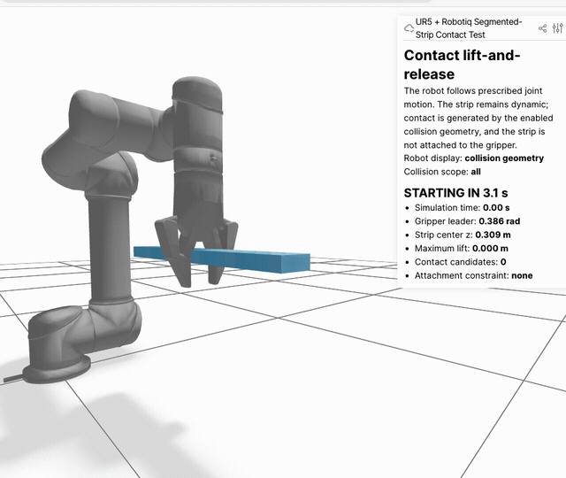

# Newton × ROS 2：累積式學習筆記

> 本文件保存家教式知識點與工程判斷，採「只在後面追加新里程碑」的方式維護。舊筆記不因後續實作而覆蓋或改寫。每個新里程碑都會加入少量「教授可能會問」與可辯護的回答。英文技術證據請見 [`NEWTON_ROS2_INTEGRATION.md`](NEWTON_ROS2_INTEGRATION.md) 與 [`NEWTON_SOFT_STRIP_EXPERIMENT.md`](NEWTON_SOFT_STRIP_EXPERIMENT.md)。

## 里程碑索引

1. ROS 2 與 Newton 的 Python 環境隔離
2. 雙向 bridge、狀態回傳與 `STALE` 故障偵測
3. ROS time、simulation time、wall time 與 physics `dt`
4. UR5＋Robotiq URDF、主動關節與 mimic 關節
5. mesh URI 解析、shape 驗證與 forward kinematics
6. ROS 控制 UR5＋Robotiq 運動學展示
7. FEM 橡膠條、量測定義與 X 向網格收斂

記錄日期：2026-09-10。

## 這一階段完成了什麼

我們已經讓 ROS 2 可以控制一個獨立的 Newton 物理程序，並將 Newton 算出的球體位置傳回 ROS。已驗證執行、暫停、重設與資料中斷偵測。

目前尚未把 UR5、Robotiq、MoveIt 或 `ros2_control` 接進 Newton。

## 為什麼要有 bridge

ROS 2 Humble 使用 Python 3.10，能正常執行 Newton solver 的隔離環境使用 Python 3.12。兩套環境像使用不同語言的兩個部門：bridge 負責翻譯命令與狀態，避免為了安裝其中一邊而破壞另一邊。

```text
ROS：請開始、暫停、重設
             ↓
           bridge
             ↓
Newton：計算重力與碰撞
             ↓
           bridge
             ↓
ROS：收到實際位置與模擬時間
```

## 我應該會判斷什麼

### 1. 命令不等於狀態

命令是「希望系統怎麼做」，狀態是「系統實際變成什麼」。服務回覆成功，只能證明 bridge 已送出命令；還要查看 Newton 回傳的狀態，才能確認效果。

### 2. 資料必須有新鮮度

Newton 停止後，bridge 回報 `STALE`。如果系統繼續把最後位置當成最新資料，MoveIt 或控制器可能在錯誤資訊上做決定。

Newton endpoint 也提供只綁定 loopback 的 Viser 畫面，而且刻意不放運動按鈕：動作只能從 ROS 發出，面板顯示 Newton 的模擬時間、實際高度、運行狀態、最後 ROS 指令與回傳序號。Viewer 用來觀察；topic 回傳與 `STALE` 故障測試才是整合驗收證據。

### 3. 電腦等待時間不等於模擬時間

Shell 的 `sleep 1` 只保證命令等待約一秒。ROS discovery、程序排程和通訊也會耗時。需要精確實驗時，應用 Newton 的模擬時間或狀態條件作為停止標準。

### 4. 看見模型不代表模型行為正確

展開後的模型有 24 個 links 與 23 個 joints。UR5 有六個獨立關節；Robotiq 雖然列出六個旋轉關節，實際只有左 knuckle 是主關節，另外五個使用 `mimic` 跟隨。

生活化理解：Robotiq 像一個馬達拉動整套連桿。URDF 的 mimic 規則說明其他關節如何跟著主關節轉動。

Newton XPBD 不會自動保證這些 mimic 關節連動。若只看到模型成功載入就宣布完成，夾爪外觀可能正常，物理行為卻是錯的。

## 已驗證：UR5＋Robotiq 靜態載入 Newton

第一次載入展開後的 URDF 時，Newton 得到 24 個 bodies、24 個 Newton joints，但 shapes 是 0。這代表關節拓樸已解析，`package://...` 指向的視覺與碰撞 mesh 卻沒有解析；因此當時還不能顯示或進行接觸模擬。

接著用 `ros2 pkg prefix --share` 找到兩個套件的實際位置，建立 Newton 專用的衍生 URDF，把 `package://ur_description/...` 與 `package://robotiq_description/...` 改為絕對路徑。ROS 的原始 Xacro 與 URDF 都沒有修改。第二次載入得到：

```text
Bodies: 24
Joints: 24
Shapes: 54
```

模型有 shape 後仍未立即出現在 Viewer，因為還需要執行 `newton.eval_fk()`，將關節座標轉換成每個連桿的世界座標。完成 FK 後，實際檢查確認 UR5 連桿連續、Robotiq 位於手腕末端，而且左右手指都存在。

本里程碑只證明靜態幾何與組裝可以進入 Newton。它尚未證明關節方向、mimic 連動、自碰撞、接觸、動力學或 ROS 對機器人的控制。下一個驗收項目是讓一個手臂關節與夾爪主關節運動，並核對所有跟隨關節的回傳值。

### 這次應記住的判斷

- body／joint 數量正確，只代表拓樸可讀。
- `Shapes: 0` 代表沒有可顯示或碰撞的幾何，不能宣稱模型載入成功。
- 畫面出現前需要 FK；幾何存在與世界座標初始化是不同步驟。
- 被動關節雖然沒有馬達，仍必須遵守機械連動關係。
- 靜態外觀正確仍不能證明運動或抓取正確。

## 目前的工程決策

ROS 維持一個夾爪命令。Bridge 讀取 URDF 內每個 mimic 的倍率與偏移，替 Newton 設定所有跟隨關節。Newton 再計算接觸與物體是否被支撐。

後續必須確認：

- 每個 mimic 關節的正負方向、倍率與 offset；
- ROS 和 Newton 的 joint names、順序及單位；
- fake hardware 與 Newton 不會同時發布互相衝突的機器人狀態；
- Viewer、ROS topic 與 Newton 內部狀態彼此一致。

## 身為工程師，我真正需要會什麼

我不需要背出每一行 bridge 程式，但必須能回答以下問題。

### 1. 定義成功，而不是只說「可以動」

先把任務改寫成可以量測的條件。例如夾爪閉合不等於抓取成功；物體必須離開支撐面、在搬運期間保持住，而且相對滑移不能超過事先定義的門檻。

### 2. 找出系統中的事實來源

MoveIt 的軌跡是目標，Newton 算出的關節與物體狀態才是模擬結果。Newton 接管機器人後，fake hardware 不能同時發布另一套 `/joint_states`，否則 ROS 會收到互相矛盾的狀態。

### 3. 檢查介面的契約

兩個系統連接時，要逐項確認：

- 名稱：ROS 與 Newton 的 joint name 是否完全一致；
- 單位：旋轉關節用 rad、直線位移用 m、力矩用 N·m；
- 座標系：數值是相對 `world`、base 還是 tool；
- 順序：陣列中的第幾個值對應哪個關節；
- 更新率與逾時：多久沒有新資料要判定為 `STALE`；
- 控制語意：傳的是位置目標、速度、力，還是實際量測值。

### 4. 分清楚四種時間

- wall time：現實世界經過多久；
- ROS time：ROS 節點使用的時鐘；
- simulation time：Newton 模擬世界經過多久；
- physics `dt`：求解器每一次前進的時間間隔。

它們不一定相等。精確實驗應依 simulation time 或狀態條件停止，不能把 `sleep 1` 當成精確的一秒模擬。

### 5. 用證據區分故障位置

| 現象 | 優先檢查的邊界 |
|---|---|
| ROS service 不存在 | ROS adapter 是否啟動、workspace 是否 source |
| service 回覆成功，但狀態不變 | 命令是否到達 Newton、是否收到 acknowledgement |
| Newton 狀態改變，但 ROS 沒更新 | bridge 回傳路徑、topic type、資料是否 `STALE` |
| 手臂動錯關節或方向 | joint names、陣列順序、單位、axis |
| 夾爪只有一部分動 | mimic multiplier／offset 是否保留 |
| Viewer 與 ROS 顯示不同 | 是否讀到不同程序、重複 publisher、frame 或時間不同 |
| 抓取結果不穩定 | 接觸參數、控制輸入、`dt`、solver iterations 與初始位置 |

### 6. 知道模擬可以證明到哪裡

Fake hardware 可以驗證 ROS 指令流程，不能驗證重力或抓取。Newton 剛體接觸可以研究摩擦與滑移，但未經校準不能直接宣稱真實 Robotiq 需要多少夾力。實體安全、材料變形、感測誤差和 sim-to-real 仍需要另外驗證。

### 7. 設計能推翻自己想法的測試

工程實驗不是找一張支持直覺的畫面。應固定其他條件、一次改一個變因，並加入故障測試。例如停止 Newton，確認 ROS 是否回報 `STALE`；這比只測正常運作更能證明系統設計。

## 可以交給 AI 與不能交出的責任

可以交給 AI：產生程式、修改設定、執行重複測試、整理 log、繪圖與格式化文件。

工程師仍需負責：定義需求、選擇架構與事實來源、確認介面契約、判斷實驗能否區分原因、拒絕超過證據的結論，以及向教授或團隊清楚說明限制。

## 我的工程判斷筆記格式

每個里程碑只要回答六項：

1. **Objective：**要解決什麼問題？
2. **Success criterion：**哪些量測結果才算成功？
3. **System boundary：**命令與狀態經過哪些元件？
4. **Evidence：**實際觀察到什麼？
5. **Limitations：**目前不能證明什麼？
6. **Next decision：**下一個測試要排除哪一種不確定性？

## 教授可能會問

**問：為什麼不用同一個 Python 程序？**

答：已驗證的 ROS 與 Newton 環境使用不同 Python 版本。分離程序可以保護依賴並讓故障邊界清楚。

**問：怎麼證明已經整合，而不是兩邊各自運作？**

答：從 ROS 發出命令，確認 Newton 狀態改變，再確認相同狀態回到 ROS；停止 Newton 後，ROS 必須偵測到資料過期。

**問：模型載入成功，為什麼還不能說 Robotiq 可用？**

答：載入只證明格式可讀。還需驗證 mimic 關節、控制單位、接觸與回傳狀態。

## 可放進英文報告的句子

> I verified a bidirectional command-and-feedback path between ROS 2 Humble and Newton while keeping their Python environments isolated.

> Import success alone is insufficient evidence of correct robot behavior; the Robotiq mimic-joint coupling must also be preserved and verified.

> Simulator failures are reported as stale data instead of allowing the last state to appear current.

## 貢獻說明

Codex 建立 bridge 程式並整理文件。專案負責人實際執行建置與驗證指令、回傳輸出，並參與判讀結果。UR5／Robotiq 導入 Newton 仍是下一階段工作。

## 里程碑 6：ROS 控制 UR5＋Robotiq 運動學展示（2026-09-11）

ROS 呼叫既有的 `/newton/set_running` 後，Newton 執行八秒的 UR5 移動、夾爪閉合、手腕轉動與返回流程。Newton 將 12 個旋轉關節的名稱與角度回傳 `/newton/joint_states`。實測暫停在 `GRIPPER_CLOSE` 時，主關節為 `0.4815 rad`，五個 follower 分別依 `+1` 或 `-1` 倍率跟隨，`mimic_max_error` 為 `0.0 rad`。

### 程式原理：直接給角度，再做正向運動學

目前程式沒有給末端目標位置，也沒有執行逆向運動學。它依模擬時間直接算出關節角度 `q(t)`，寫入 Newton 的 `joint_q`，再呼叫 `newton.eval_fk()`，由正向運動學算出所有連桿在世界座標中的姿態。

```text
時間 t → 預先指定的關節角度 q(t) → FK → 各連桿姿態
```

角度換算公式是 `degree = rad × 180 / pi`。初始六軸角度為 `(0, -90, +90, -90, -90, 0)` 度。

| 模擬時間 | 階段 | 實際指定的變化 |
|---|---|---|
| 0–2 秒 | `ARM_APPROACH` | shoulder pan：`0 → +0.55 rad`（`+31.5°`）；elbow：`+1.571 → +1.221 rad`，變化 `-0.35 rad`（`-20.1°`） |
| 2–4 秒 | `GRIPPER_CLOSE` | 夾爪主關節：`0 → +0.70 rad`（`+40.1°`），其他五軸依 mimic 公式跟隨 |
| 4–6 秒 | `WRIST_MOTION` | wrist 3：`0 → +0.65 → 0 rad`，最大 `+37.2°` |
| 6–8 秒 | `RETURN_AND_OPEN` | 上述手臂關節回到初始角度，夾爪回到 0 |

靠近與返回使用 `s = 3u² - 2u³` 的 smoothstep，使指定位置曲線在一段動作的起點與終點斜率為零。這只是讓角度命令平順，沒有計算馬達力矩，也不能證明真實控制器跟得上。

這次只有 shoulder pan、elbow、wrist 3 與夾爪主關節在動。Shoulder lift、wrist 1、wrist 2 保持固定，因此不能說「六軸都測試正常」。能宣稱的是：被測關節的名稱、索引、方向與單位有初步證據，FK 畫面、mimic 映射及 ROS 狀態回傳一致。

### MoveIt 在前一個專案中負責什麼

MoveIt 接收末端姿態或關節目標，透過運動學與規劃元件產生軌跡，並檢查 planning scene 中的碰撞，再把軌跡交給 `ros2_control`。先前使用 fake hardware，所以驗證了規劃、控制器介面與任務順序，沒有驗證物體接觸。

目前 Newton 展示沒有呼叫 MoveIt、IK 或 path planner；它直接指定 `q(t)`，目的是先排除 bridge、joint mapping、FK 與 mimic 的問題。下一階段才是把 MoveIt 產生的 joint trajectory 送到 Newton 的 actuator target，並讓 Newton 回傳唯一的模擬狀態。

可以用一句話區分：**MoveIt 決定希望機器人沿哪條軌跡走；Newton 應負責計算在物理條件下實際走成什麼樣。**

### 我如何從程式確認上述說法

不用背程式，但要會找到證據：

- `newton_robot_endpoint.py` 的 `update_pose()` 直接寫 `arm[0]`、`arm[2]`、`arm[5]` 與 `grip`，所以輸入是關節角度，不是末端 pose。
- 同一函式最後呼叫 `newton.eval_fk()`，所以目前是由關節角度推算連桿姿態的 FK。
- 程式沒有呼叫 MoveIt、IK solver 或 trajectory planner，因此不能說這段動作是規劃出來的。
- `ros_adapter.py` 將 `joint_names` 與 `joint_positions` 包成 `/newton/joint_states`，所以可以從 ROS 核對 Newton 回傳的狀態。
- `publish_status()` 使用封包年齡判定 `OK` 或 `STALE`，所以畫面停止與通訊中斷能被區分。

英文文件會保留這類實作片段、檔案責任、測試證據與限制；本中文文件則保存你需要理解及口頭回答的判斷方法。

### 工程師應該會判斷什麼

1. **看到機器人移動，不代表動力學正確。** 本次直接指定 joint position 並用 FK 更新連桿，是運動學介面測試。
2. **命令成功與狀態成功必須分開驗證。** ROS service 是輸入；`/newton/joint_states`、phase 與 mimic error 才是回傳證據。
3. **`mimic_error = 0` 只證明數學映射一致。** 它不能證明手指接觸力、摩擦或物體抓取正確。
4. **測試 topic 不是正式狀態來源。** 目前使用 `/newton/joint_states`，尚未取代 fake hardware 的 `/joint_states`，因此不應同時宣稱 Newton 已接管 MoveIt。
5. **展示範圍必須能一句話說清楚。** 已驗證 ROS 命令、FK、mimic 與回傳；尚未驗證動態控制、碰撞抓取及真實硬體。

### 教授可能會問

**問：這算 ROS 2 與 Newton 整合完成了嗎？**

答：已完成可觀察的命令與狀態橋接，也完成機器人運動學展示；MoveIt 控制、動力學接觸與正式 `/joint_states` ownership 尚未完成。

**問：為什麼 `mimic_error = 0` 還不能證明夾得住物體？**

答：mimic error 只比較 follower joint angle 是否符合 URDF 公式。抓取還取決於碰撞幾何、摩擦、接觸力、物體質量與運動加速度。

**問：這次最重要的架構判斷是什麼？**

答：重用已驗證的 ROS–Newton bridge，只替換 Newton 端模型與狀態內容；同時保留 namespaced topic，避免和現有 fake hardware 爭奪狀態來源。

**問：這段動作有用逆向運動學嗎？**

答：沒有。程式直接定義關節角度隨時間的變化，再用 FK 更新連桿姿態。它適合驗證介面與關節對應，不能代表 MoveIt 規劃或動態軌跡追蹤已完成。

**問：`mimic_error = 0`，但畫面上手指互相穿過，模型算正確嗎？**

答：不算。零誤差只證明 follower angle 符合代數公式；還必須檢查 joint axis、origin、mesh、collision geometry 與 self-collision 設定。

## 里程碑 7：FEM 橡膠條與網格收斂（2026-09-11）

本階段建立一條 `0.40 × 0.05 × 0.02 m` 的四面體 FEM 條狀物，左端固定。基準網格 `20 × 3 × 2` 產生 252 個 particles、600 個 tetrahedra、424 個 surface triangles 與 12 個固定粒子；所有拓樸與尺寸檢查通過。

### 這三種網格數量是什麼

- **252 particles（節點）：** FEM 網格上的計算點，保存位置、速度與質量等狀態；它們不是材料中的真實分子。
- **600 tetrahedra（四面體體積元素）：** 每個元素由四個節點構成。Newton 在這些小體積中計算拉伸、壓縮與剪切，因此它們決定物體內部如何變形。本網格每個方格拆成 5 個四面體，所以 `20 × 3 × 2 × 5 = 600`。
- **424 surface triangles（表面三角形）：** 位於物體外皮的三角面，描述可看見及發生表面接觸的邊界；內部四面體共用的面不算外表面。

可以記成：**particles 是點、tetrahedra 填滿體積、surface triangles 包住外表面。** 數量正確只證明網格拓樸符合設定，還不能證明材料行為正確。

### 從直覺改成專業用詞

「把同一張紙切成更多份，但外觀仍是同一張紙」是正確直覺。專業說法是：我們提高了**網格解析度（mesh resolution）**，沒有改變**材料密度（density，kg/m³）**或幾何尺寸。

將 `CELLS_X` 從 20 增加到 40，只細分長度方向。固定面位於左端的 Y–Z 截面，而 `CELLS_Y` 與 `CELLS_Z` 沒變，所以固定粒子數仍為：

\[
(3+1)(2+1)=12
\]

粗、細網格使用相同幾何與材料。比較兩次的目的不是製造兩個不同物體，而是確認加入物理後的末端下垂量是否對離散方式敏感。若加密後結果仍大幅改變，就尚未達到 mesh convergence，不能把單一網格的結果當成可靠物理結論。

### 材料參數代表什麼

本次使用 `E = 1,000,000 Pa`、`nu = 0.45`、密度 `1,100 kg/m³`。Newton 需要由這兩個彈性參數換算出的 Lamé parameters：

```text
mu     = 344,827.586 Pa
lambda = 3,103,448.276 Pa
lambda / mu = 9
```

`nu = 0.45` 表示接近不可壓縮：材料彎曲時可以改變形狀，但體積不容易改變。它不等於剛體，也不代表不會變形。`nu` 越接近 `0.5`，`lambda` 會快速增加，數值求解也會更困難。

這些是橡膠狀測試參數，沒有從真實試片校正。阻尼 `1,000 Pa·s` 也只是本次數值實驗設定，不能對教授說成實測橡膠材料數據。

### 我們實際量測什麼

初始自由端粒子的平均高度是 `0.51 m`。程式每一幀讀取最右端所有粒子的實際 z 座標，再計算：

```text
自由端平均高度 = mean(最右端粒子的 z)
向下撓度 = 初始自由端平均高度 - 現在的平均高度
```

因此撓度是和**同一批自由端粒子的初始位置**比較，不是與地板比較，也不是粒子走過的總路徑。

為了避免拿還在振動的瞬間值比較，我們預先設定：最後一秒內自由端高度的最大值減最小值必須小於 `0.004 m`。4 mm 等於條長 0.40 m 的 1%。固定端最大誤差也必須為零，而且所有粒子座標必須是有限值。

### 網格收斂結果


GIF 以約 2 倍速度播放 `20 × 3 × 2` 網格的八秒模擬，可看到左端保持固定、自由端受重力下垂並擺動。它是「行為隨時間發生」的定性證據；下表的撓度、振幅與網格比較才是定量驗收證據。

| X cells | 最後一秒平均向下撓度 | 最後一秒振幅範圍 |
|---:|---:|---:|
| 20 | `0.38028 m` | `3.995 mm` |
| 40 | `0.40283 m` | `3.922 mm` |
| 80（至少執行 20 秒） | `0.40800 m` | `0.135 mm` |

20→40 的撓度差是 `5.60%`，超過預先設定的 5% 門檻，所以當時不能宣稱收斂。40→80 的差降到 `1.27%`，因此**平衡撓度通過 X 方向的網格收斂標準**。

這不是完整三維網格收斂，因為 `CELLS_Y` 與 `CELLS_Z` 沒有加密。更精確的說法是：在目前材料、求解器與容許值下，平衡自由端撓度對 X 方向從 40 加密到 80 cells 的變化小於 5%。

### 為什麼 80 cells 要重跑

第一個 80-cell 測試剛到最低觀察時間 5 秒就顯示 `settled: true`，但 40-cell 模型先前需要更久才小於門檻。這個趨勢反常，因此不能只相信布林值。我們把最低觀察時間強制改成 20 秒，撓度由 `0.41002 m` 變成 `0.40800 m`，只差 `0.49%`，最後一秒振幅仍只有 `0.135 mm`。

這個交叉檢查支持**平衡撓度**，卻不能證明**settling time**。目前輸出的 `settling_time_s` 是允許檢查後偵測到門檻的時間；若系統在最低觀察時間之前就已符合條件，它不是獨立量出的真實安定時間。

這正是工程判斷：

1. 看到 `true` 之前要先讀清楚它的定義。
2. 結果如果違反合理趨勢，要加一個能推翻原結論的交叉測試。
3. 靜態平衡結果與暫態振動結果必須分開驗證。
4. 只能宣稱測過的方向、參數與容許範圍。

### 計算成本也是工程結果

80-cell 的 20 秒模擬花了 `212.07 s` 現實時間，real-time factor 是 `0.0943`。也就是在這台 aarch64 CPU VM 上，每一秒模擬時間約需要 `10.60 s` 現實時間。網格越細通常能降低離散誤差，但會增加記憶體與計算成本；工程師要依研究問題選擇「足夠可信」的網格，而不是盲目追求最多 cells。

### 教授可能會問

**問：為什麼看到橡膠條正常下垂還不算驗證完成？**

答：動畫只能提供定性證據。我還檢查了網格尺寸與數量、固定端誤差、有限狀態、最後一秒振幅，以及 20／40／80 cells 的撓度變化。

**問：你能說 FEM 結果已經完全網格收斂嗎？**

答：不能。目前只加密 X 方向，因此能宣稱的是縱向加密後的平衡撓度差低於 5%；Y、Z 方向、時間步與 solver iterations 仍需另外驗證。

**問：為什麼不直接用材料力學的小撓度樑公式核對？**

答：本次撓度約等於 0.40 m 條長，已是大變形。線性 Euler–Bernoulli 小撓度假設不適合直接作為驗收真值。

**問：80 cells 比 40 cells 更快安定，是否代表模型更準？**

答：不能這樣說。平衡撓度與暫態安定時間是不同輸出；目前只驗證前者的 X 向收斂。暫態還會受阻尼、離散與停止條件影響。

### 本階段可辯護的結論

Newton 已建立可重現的四面體 FEM 橡膠條；拓樸、幾何、固定邊界及數值有限性通過檢查。40→80 cells 的平衡撓度差為 `1.27%`，通過預設的 5% X 向收斂門檻。材料尚未校正，暫態與完整三維網格尚未驗證，也還沒有和機器人接觸。

## 里程碑 8：剛體分段柔性近似與 FEM 比較（2026-09-14）

### 我們建立的是什麼

這個模型像「關節蟲」或多節摺尺：每一節是 **rigid segment（剛體節段）**，節段之間由 **revolute joint（旋轉關節）**連接。柔軟感來自關節，而不是每一節本身變形。

- **joint stiffness / torsional stiffness（關節剛性／扭轉剛性）**：像關節內的扭轉彈簧，偏離原角度後提供回正力矩，單位 `N·m/rad`。
- **joint damping / rotational damping coefficient（關節阻尼／旋轉阻尼係數）**：像門弓器，依轉動速度消耗振動能量，單位 `N·m·s/rad`。
- **deflection（撓度）**：指定位置相對無載參考位置的位移。本實驗是「初始自由端平均 z − 最後一秒自由端平均 z」。
- **peak-to-peak range（峰對峰範圍）**：最後一秒最高 z 減最低 z，用來判斷是否仍在明顯擺動。
- **kinematic root（運動學固定根部）**：第一節的位置由模型直接固定，用來精確表達懸臂邊界。

彎曲參數由材料與截面換算：

```text
I = b h^3 / 12 = 3.333333e-8 m^4
EI = 0.033333 N m^2
每節長度 = L / N
每個關節剛性 = EI / 每節長度
```

關節可用下式理解：

```text
回正與耗能力矩 = -kθ × 關節角度 - cθ × 關節角速度
```

只有彈簧時會長時間來回擺；只有阻尼時會減慢轉動，卻沒有恢復原角度的依據；兩者都有才會彎曲、回彈並逐漸安定。

### 為什麼不用 fixed joint 固定根部

最初以 **fixed joint（固定關節）**連到世界，但 XPBD 是迭代式求解器：10 iterations 時根部仍漂移 `0.418 mm`，提高到 40 iterations 仍有 `0.214 mm`，且計算成本上升。改成 kinematic root 後根部誤差為 `0.0 m`。

工程判斷不是「哪個做法名稱比較真實」，而是邊界條件是否符合研究問題。這次要比較懸臂條本身，所以根部必須精確固定；未來夾爪抓取時，則不能用 kinematic attachment 假裝抓牢，必須恢復真實接觸與摩擦。

### 為什麼會出現 contact buffer overflow

40 節模型開啟 self-collision（自碰撞）後，彎折的節段同時產生超過 2,000 組候選接觸，超過 contact buffer（接觸緩衝區）容量。這代表部分接觸可能被丟棄，結果與速度都不再可信。

本階段只比較重力下的整體彎曲，而且 FEM 基準也沒有驗證自碰撞，所以關閉節段 shape collisions。未來研究抓取時要重新啟用接觸，並設定 collision filtering（碰撞過濾）與足夠的緩衝容量；不能把這次的關閉設定直接帶到抓取結論。

### 20／40／80 segments 的結果


動畫中每一個彩色方塊都是剛體；相鄰方塊之間的旋轉才形成整體彎曲。畫面是定性證據，用來確認模型結構與運動是否符合預期；下表的撓度、振幅與加密差異才是定量驗收。

| Segments | 關節剛性 | 關節阻尼 | 最後一秒平均撓度 | 最後一秒範圍 |
|---:|---:|---:|---:|---:|
| 20 | `1.6667 N·m/rad` | `0.020 N·m·s/rad` | `0.352523 m` | `3.176 mm` |
| 40 | `3.3333 N·m/rad` | `0.040 N·m·s/rad` | `0.381506 m` | `3.945 mm` |
| 80 | `6.6667 N·m/rad` | `0.080 N·m·s/rad` | `0.401202 m` | `3.980 mm` |

20→40 的撓度差為 `7.60%`，超過 5%，所以 20 節不夠。40→80 的差為 `4.91%`，低於 5%，因此平衡撓度通過既定的縱向加密門檻。

但 80 節的最後一秒範圍是 `3.980 mm`，只比 4 mm 門檻小 `0.020 mm`。這是 **boundary pass（邊界通過）**：可以說通過預先定義的條件，不能說暫態已充分收斂或結果很穩健。

### 模型選擇的工程判斷

80-segment 撓度與 FEM 80-cell 的 `0.408003 m` 相差 `1.67%`。兩種離散方式得到接近結果，是有價值的交叉證據，但兩者都沒有和實體橡膠試片校正，所以不能稱為材料真值驗證。

在同一 CPU 環境，80-segment 的 real-time factor 是 `0.762`，FEM 80-cell 是 `0.0943`，分段模型約快 `8.1` 倍。

- 要快速測試機械手運動、接口與大致彎曲：分段模型較合適。
- 要研究連續材料內部變形、局部形變或更真實接觸：FEM 較合適。
- 模型越複雜不一定越適合；工程師應依問題選擇「足以回答問題」且可驗證的模型。

### 教授可能會問

**問：40→80 已小於 5%，是否證明模型完全正確？**

答：沒有。它只證明目前參數下的平衡自由端撓度對縱向分段加密已低於既定容許值；材料校正、時間步、阻尼、接觸與實體實驗仍未驗證。

**問：為什麼 segment 越多，每個關節反而越硬？**

答：節段長度變成 `L/N`，為維持相同連續樑彎曲剛度 `EI`，離散關節剛性使用 `kθ = EI/(L/N)`，因此 N 加倍時單一關節剛性也加倍。

**問：兩個模型結果接近，為何選更快的分段模型？**

答：下一階段重點是 MoveIt 命令、Newton 回傳與物體整體反應，分段模型已在目前量測下接近 FEM 且快約 8.1 倍。FEM 保留為較高細節的參考，而不是每一次接口測試都支付其計算成本。

## 里程碑 9：機械手接觸夾持、失敗推導與量測修正（2026-09-15）

### 這次真正證明了什麼

UR5／Robotiq 依預先設定的關節運動，在 Newton 中透過碰撞與摩擦夾住 20 節分段膠條、抬升並在張開後釋放。膠條沒有 attachment constraint（附著約束），因此不是把物體座標直接貼在夾爪上。

這是 **pre-positioned contact lift-and-release（預先放置的接觸抬升與釋放）**。它還不是 MoveIt 軌跡、自主尋找物體、真實夾持力校正或實體橡膠驗證。



### 為什麼保留失敗過程

最初使用 `0.72–0.74 rad` 夾取 50 mm 寬膠條，看起來曾經成功。但換算後的指尖開口只有約 8–6 mm，視覺檢查也發現膠條可能卡住、被指尖托住，或穿過為診斷而關閉碰撞的手臂。這些證據推翻了「摩擦夾持成功」的初始解釋。

改成完整機器人碰撞後，`0.36625 rad` 在指尖高度的碰撞包圍盒開口約為 `48.97 mm`。可是膠條原本放在 `z=0.340 m`，對到的上段夾指間距約 `57.62 mm`，大於膠條寬度，所以根本沒有形成對向接觸。這教會我們：**joint angle（關節角度）不能單獨代表實際 aperture（開口），還必須檢查物體高度與三維 collision geometry（碰撞幾何）。**

把膠條降到 `z=0.309 m` 後才對準指尖接觸區。夾末端時，均勻膠條的重心離夾點約 `0.20 m`：

```text
重量 = 0.44 × 9.81 = 4.32 N
力臂 = 0.20 m
重力力矩 = 4.32 × 0.20 ≈ 0.86 N·m
```

因此改夾 center-of-mass region（重心區域），讓 moment arm（力臂）接近零。`0.36625 rad` 能接觸但在上升時滑落；只把閉合角改成 `0.386 rad`，其餘條件固定，就能抬升並在張開後才掉落。這個單一變因測試支持原本的 normal clamping action（正向夾持作用）不足，但不能把角度直接宣稱成真實夾持力。

### 為什麼原本的程式誤判失敗

原本用 20 節膠條的平均高度判斷抬升。中心被夾住時，兩側仍會下垂，所以整體平均只上升 `45.48 mm`，即使畫面明顯顯示中心跟著夾爪移動，程式仍輸出失敗。

修正後追蹤夾爪位置的兩個中央節段：

```text
接觸保持結束高度     0.279712 m
抬升保持結束高度     0.398397 m
實際夾持區上升量     0.118685 m
命令上升量           0.120000 m
追隨誤差             0.001315 m
釋放後下降量         0.388397 m
finite state          true
```

驗收條件是夾持區上升與命令差小於 20 mm、張開後下降超過 50 mm，而且狀態有限；本次全部通過。抬升前夾持區先向下安定 `29.29 mm`，也必須記錄，因為目前物體是一開始就放在閉合夾爪中，再自行找到穩定接觸位置。

程式的 contact candidates（候選接觸數）不等於真正承載力量的接觸，因此不再拿候選數當成功證明。成功判斷改用獨立模擬的夾持區是否跟隨手臂，以及張開後是否分離。

### 這階段要會的工程判斷

- **gravitational moment（重力力矩）**：`M = Fd`；夾點離重心越遠，越容易旋轉與滑落。
- **grasp region（夾持區域）**：應追蹤真正被夾住的位置，不應盲目使用整個柔性物體的平均值。
- **control variable（控制變因）**：一次只改一項，才知道結果為什麼改變。
- **collision geometry（碰撞幾何）**：畫面模型與碰撞模型可能不同；穿模時要切換 collider 顯示。
- **validation metric（驗收指標）**：指標必須直接回答研究問題。數字計算正確，也可能量錯東西。
- 夾重心通常能降低力矩，但 grasp accessibility（可達性）、collision clearance（碰撞餘裕）及 task requirement（任務需求）也會決定實際夾點。

### 教授可能會問

**問：影片看起來成功，為什麼還要數值？**

答：影片能排查卡住、穿模與釋放時機，但不能精確量出追隨誤差。這次用夾持區上升 `118.685 mm` 對照命令 `120 mm`，並確認張開後下降。

**問：為什麼不用整條膠條的平均高度？**

答：柔性物體兩端會下垂，整體平均高度同時混合了機械手移動與物體變形。要驗證是否夾住，應量夾持區相對於抬升命令的運動。

**問：這已經是 MoveIt 控制嗎？**

答：不是。目前機械手關節座標由 Newton 測試程式預先指定。下一步才會讓 MoveIt 規劃軌跡、ROS 2 傳送命令、Newton 計算接觸與回傳實際物體狀態。
