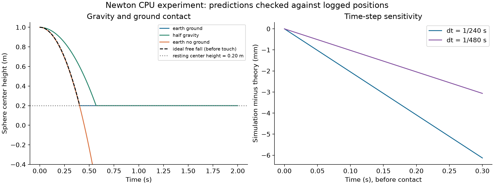

# Newton CPU experiment: sphere radius and ground contact

Documented on 2026-09-10. This is a separate Newton learning experiment; it is not connected to ROS 2, MoveIt, or the Robotiq controller.

## Visual result

This GIF replays measured Newton sphere-center positions in 2D at 30 frames/s. It is not an interactive simulator recording. Left: normal gravity with ground. Middle: half gravity with ground. Right: normal gravity without a collision plane; the sphere continues below the view. Simulation duration is 2 seconds. The finer-time-step case is in the data and chart, but is not a fourth sphere in the GIF.

## Question, prediction, and evidence

**Question:** How does increasing radius affect time to ground contact when the initial center height is unchanged?

**Prediction made by the learner:** Increasing radius makes the bottom start closer to the ground, so contact should occur earlier.

Initial center height was 1.00 m. Radius increased from 0.10 m in the previous baseline to 0.20 m in this practice run. Gravity was 9.81 m/s² and the baseline time step was 1/240 s. The sphere started at rest.

| Measurement | Previous 0.10 m radius run | Practice 0.20 m radius run |
|---|---:|---:|
| Initial bottom clearance | 0.90 m | 0.80 m |
| Ideal touch time | 0.42835 s | 0.40386 s |
| Measured near-ground time | 0.42917 s | 0.40417 s |
| Final center height | 0.10 m | 0.20 m |

The practice run reached the near-ground threshold approximately 25 ms earlier. The learner correctly identified earlier arrival and a final center height equal to the radius. These observations support the geometric prediction under the tested conditions.

**Measurement definition:** near-ground time is the first sampled time with center height no greater than radius + 0.005 m. It is not an exact solver contact-onset timestamp. The difference from ideal touch time includes threshold and sampling effects.

## Environment and checks

Python 3.12.14; Newton 1.5.1; Warp 1.17.0; Linux aarch64 inside UTM; CPU device; SolverXPBD with 10 iterations. The separate Python 3.12 environment was created after the inherited Python 3.10 environment failed when loading the solver. ROS and the original Newton environment were preserved.

All eight checks in [summary.json](results/summary.json) passed in the practice run. They cover early free-fall error, ground support/penetration, settling, the no-ground control, time-step sensitivity, and arrival-time comparisons. These are educational checks, not hardware safety certification.

Changing radius can also change derived mass and inertia under default density settings. This exercise does not establish isolated radius effects on general contact dynamics. It studies vertical free fall and ground clearance; friction, restitution, and grasping were not validated.

## Reproduce and inspect

Use a separate Python 3.12 virtual environment and install [requirements-lock.txt](requirements-lock.txt). Then run `python newton_lesson01.py` from that environment. The script writes to `results/` beside itself and replaces existing generated outputs; copy the directory elsewhere before rerunning if preserving the committed evidence is important. This does not use the ROS Python environment.

- [Experiment script](newton_lesson01.py)
- [Parameters and acceptance results](results/summary.json)
- [Normal gravity with ground CSV](results/earth_ground.csv)
- [Finer time step CSV](results/earth_half_dt.csv)
- [No-ground CSV](results/earth_no_ground.csv)
- [Half-gravity CSV](results/half_gravity.csv)

The earlier 0.10 m values above are from the preceding baseline run; the raw data in this directory belong to the 0.20 m practice run.

## Engineering notes: simulation, replay, and ROS integration

1. **Simulation:** the solver computes successive states from the model, forces, and contacts.
2. **Replay:** the viewer displays previously computed states. Changing playback speed does not change the recorded physics.
3. **ROS integration:** requires an actual command path into the simulator and a state-feedback path back to ROS, with agreed joint names, units, control semantics, and timing. Opening RViz and Newton together does not demonstrate that interface.
4. **Evidence scope:** a GIF illustrates behavior; configuration, code, logs, and numerical checks explain how the behavior was produced and assessed.

The next milestone is a live Newton scene with observable state, followed by a small command-and-feedback interface test. Full UR5/Robotiq integration and physical grasp verification remain future work.

## Learning contributions

Codex created the baseline script and supported setup and diagnosis. The learner predicted the radius effect, edited the practice radius and dynamic chart label, corrected syntax errors, executed the practice script, and interpreted the results. Codex checked the supplied results and prepared this publication. The experiment was guided, not independently implemented from scratch by the learner.

## 中文輔助筆記：如何判斷「真的接起來」

- **模擬 Simulation：** 求解器持續計算下一個狀態。
- **回放 Replay：** 顯示已算好的狀態；GIF 的播放速度不代表求解速度。
- **整合 Integration：** 命令能傳入 Newton，Newton 算出的狀態也能回到 ROS。
- **本次證據：** GIF 展示行為，CSV 提供量測，程式和版本紀錄提供重現線索。
- **本次限制：** 尚未連接 ROS，沒有驗證夾爪接觸力、摩擦抓取或實體硬體。

驗證整合時，應追蹤一個明確命令：誰送出、Newton 是否收到、哪個狀態改變、ROS 是否收到對應回報。只看兩個視窗都開著，不能證明已整合。

筆記句型：我觀察到＿＿；支持的結論是＿＿；仍缺少的證據是＿＿。
